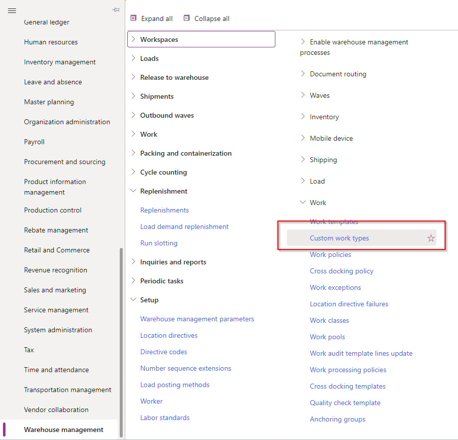
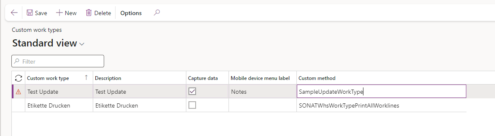

D365 F&O offers you the possibilty to customize many processes in your warehouse. One possibility to do it is using custom work types. Typically you would use for the picking work template, work types of 'Pick' and 'Put'. But you can added the type 'Custom'. Such step would allow the warehouser worker to record information or updating some information.
<!-- more -->
## Custom Work Type

You can find the custom work types under: **Warehouse amanagement -> Setup -> Work -> Custom work types**



There you can add new a custom work type for your system. The checkbox **Capute data** indicates if there should be an user input on that work type and **Mobile device menu label** is the text that is displayed on the form.



Under **Custom method** you can add your custom method that should be executed.

## Custom method

Below you can see a example code for a custom work type. You need to implement **WhsIWorkTypeCustomProcessor** and do not forget to decorate the class with **WhsWorkTypeCustomProcessorFactor** and add as the parameter the custom method name of the corresponding custom work type you created or going to create.
And then you can add your code that should be executed in the **process** function. You can read out over **_parameters** different data. Like for example the workline or the captured data from the work only if you checked **Capture data**.

Have fun :smile:

```xpp
[WhsWorkTypeCustomProcessorFactory('SampleUpdateWorkType')]
public class SampleUpdateWorkType implements WhsIWorkTypeCustomProcessor
{
    #WHSRF

    public void process(WhsWorkTypeCustomProcessParameters _parameters)
    {
        WHSWorkId currentWorkId = _parameters.workLine.WorkId;
        var userId              = _parameters.pass.lookup(#UserId);
        str notes               = _parameters.data;

        //DO SOMETHING WITH THE DATA
        
    }

}
```
